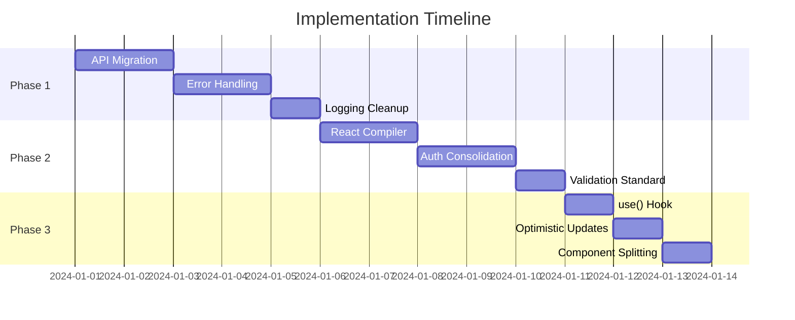

# 🚀 Implementation Plan - Codebase Consistency Fixes

**Project**: User Management UI Consistency Improvements  
**Duration**: 3 Weeks (22-28 hours)  
**Start Date**: TBD  
**Risk Level**: LOW (Refactoring only, no behavioral changes)

---

## 📋 Table of Contents

1. [Phase 1: Critical Fixes](#phase-1-critical-fixes-week-1)
2. [Phase 2: Optimization](#phase-2-optimization-week-2)
3. [Phase 3: Enhancement](#phase-3-enhancement-week-3)
4. [Testing Strategy](#testing-strategy)
5. [Rollback Plan](#rollback-plan)

---

## Phase 1: Critical Fixes (Week 1)

**Goal**: Establish consistency in API calls, error handling, and logging  
**Duration**: 8-12 hours  
**Priority**: HIGH

### Task 1.1: Consolidate API Call Patterns

**Estimated Time**: 4-5 hours  
**Files Affected**: ~60 files

#### Steps:

1. **Create API Migration Guide** (30 min)
   ```markdown
   # API Call Migration Guide
   
   ## Old Pattern → New Pattern
   
   ### Before (Direct apiClient)
   ```typescript
   const response = await apiClient.get('/api/v1/users');
   return response.data;
   ```
   
   ### After (useApiModern)
   ```typescript
   import { useApiQuery } from '@/shared/hooks/useApiModern';
   
   const { data, isLoading, error } = useApiQuery(
     ['users'],
     () => apiGet('/api/v1/users')
   );
   ```
   ```

2. **Migrate Pattern A: Direct apiClient** (2 hours)
   - Files to update: 18 files
   - Search pattern: `apiClient.get|post|put|delete`
   - Create codemod script if needed
   
   **Files**:
   ```
   src/domains/admin/services/adminService.ts
   src/domains/auth/services/authService.ts
   src/domains/profile/services/profileService.ts
   ... (15 more)
   ```

3. **Migrate Pattern B: Custom React Query hooks** (2-3 hours)
   - Files to update: 45 files
   - Replace with `useApiQuery` / `useApiMutation`
   - Keep business logic, change implementation
   
   **Example Migration**:
   ```typescript
   // Before
   export function useAdminUsers() {
     return useQuery({
       queryKey: ['admin', 'users'],
       queryFn: async () => {
         const response = await apiClient.get('/api/v1/admin/users');
         return response.data;
       }
     });
   }
   
   // After
   export function useAdminUsers() {
     return useApiQuery(
       ['admin', 'users'],
       () => apiGet('/api/v1/admin/users'),
       { errorToast: true, staleTime: 5 * 60 * 1000 }
     );
   }
   ```

4. **Update imports across codebase** (30 min)
   - Find: `import { useQuery, useMutation } from '@tanstack/react-query'`
   - Replace with: `import { useApiQuery, useApiMutation } from '@/shared/hooks/useApiModern'`

5. **Test all affected pages** (1 hour)
   - Manual smoke tests
   - Automated E2E tests
   - Verify error handling still works

#### Acceptance Criteria:

- [ ] All 18 direct apiClient calls migrated
- [ ] All 45 custom hooks use useApiModern
- [ ] No import errors
- [ ] All pages load correctly
- [ ] Error handling works consistently
- [ ] Migration guide documented

### Task 1.2: Standardize Error Handling

**Estimated Time**: 3-4 hours  
**Files Affected**: ~50 files

#### Steps:

1. **Create error handling guide** (20 min)
   ```typescript
   // ✅ CORRECT Pattern
   import { handleError } from '@/core/error';
   import { useToast } from '@/hooks/useToast';
   
   try {
     await someOperation();
   } catch (error) {
     const result = handleError(error);
     toast.error(result.userMessage);
     
     if (result.redirectToLogin) {
       navigate('/login');
     }
   }
   ```

2. **Update catch blocks** (2-3 hours)
   - Find all: `catch (error)`
   - Update to use `handleError()`
   - Remove manual error extraction
   
   **Search pattern**:
   ```typescript
   catch (error) {
     // Manual error handling
     const message = error instanceof Error ? error.message : '...';
   }
   ```

3. **Add error boundaries** (1 hour)
   - Add to domain pages
   - Use `ModernErrorBoundary` from shared/components
   
   **Files**:
   ```
   src/domains/admin/pages/AdminDashboard.tsx
   src/domains/profile/pages/ProfilePage.tsx
   src/domains/users/pages/UserListPage.tsx
   src/domains/auth/pages/LoginPage.tsx
   ... (10 more)
   ```

4. **Test error scenarios** (30 min)
   - Network errors
   - 401/403 errors
   - Validation errors
   - Server errors (500)

#### Acceptance Criteria:

- [ ] All catch blocks use handleError()
- [ ] Error boundaries on all domain pages
- [ ] Consistent error messages
- [ ] Proper error logging
- [ ] No manual error extraction

### Task 1.3: Remove console.log Usage

**Estimated Time**: 1-2 hours  
**Files Affected**: ~15 files

#### Steps:

1. **Find all console.log usage** (10 min)
   ```bash
   grep -r "console.log\|console.error\|console.warn" src/
   ```

2. **Replace with logger** (1 hour)
   ```typescript
   // Before
   console.log('User logged in', { userId });
   console.error('Login failed', error);
   
   // After
   import { logger } from '@/core/logging';
   
   logger().info('User logged in', { userId });
   logger().error('Login failed', error);
   ```

3. **Add ESLint rule** (15 min)
   ```javascript
   // eslint.config.js
   rules: {
     'no-console': ['error', { allow: ['warn', 'error'] }]
   }
   ```

4. **Update JSDoc examples** (15 min)
   - Replace console.log in code examples
   - Use proper logger in documentation

5. **Run ESLint fix** (10 min)
   ```bash
   npm run lint -- --fix
   ```

#### Acceptance Criteria:

- [ ] No console.log in src/ (except tests)
- [ ] All logging uses logger()
- [ ] ESLint prevents console usage
- [ ] Documentation updated

---

## Phase 2: Optimization (Week 2)

**Goal**: Leverage React 19 features and remove unnecessary code  
**Duration**: 8-10 hours  
**Priority**: MEDIUM

### Task 2.1: Enable React Compiler

**Estimated Time**: 2-3 hours  
**Files Affected**: Build config + all components

#### Steps:

1. **Install React Compiler** (10 min)
   ```bash
   npm install -D babel-plugin-react-compiler
   ```

2. **Update vite.config.ts** (15 min)
   ```typescript
   import { defineConfig } from 'vite';
   import react from '@vitejs/plugin-react';
   
   export default defineConfig({
     plugins: [
       react({
         babel: {
           plugins: [
             ['babel-plugin-react-compiler', { target: '19' }]
           ]
         }
       })
     ]
   });
   ```

3. **Test build** (30 min)
   - Run production build
   - Check for compiler errors
   - Verify bundle size

4. **Performance benchmarks** (1 hour)
   - Before: Run Lighthouse
   - After: Run Lighthouse
   - Compare results
   - Document improvements

5. **Remove useMemo/useCallback** (1-1.5 hours)
   - Search: `useMemo|useCallback`
   - Review each usage
   - Remove if not needed (most cases)
   - Keep only if:
     - Dependency is expensive to compute
     - Used in useEffect dependency array
     - Passed to native DOM (rare)

#### Acceptance Criteria:

- [ ] React Compiler enabled
- [ ] Build succeeds
- [ ] No performance regression
- [ ] 50+ useMemo/useCallback removed
- [ ] Bundle size documented

### Task 2.2: Remove React.memo Overuse

**Estimated Time**: 1-2 hours  
**Files Affected**: ~15 files

#### Steps:

1. **Find all React.memo usage** (10 min)
   ```bash
   grep -r "React.memo\|memo(" src/
   ```

2. **Evaluate each usage** (1 hour)
   - Remove if component doesn't have expensive renders
   - Keep if:
     - Component renders frequently
     - Props are stable
     - Verified performance benefit

3. **Test rendering performance** (30 min)
   - Use React DevTools Profiler
   - Compare before/after
   - Document results

#### Files to Review:

```
src/domains/rbac/components/OptimizedCanAccess.tsx
src/domains/rbac/components/OptimizedRoleBasedButton.tsx
... (13 more)
```

#### Acceptance Criteria:

- [ ] React.memo only where needed
- [ ] No performance regression
- [ ] Profiler results documented

### Task 2.3: Consolidate Auth Contexts

**Estimated Time**: 3-4 hours  
**Files Affected**: ~25 files

#### Steps:

1. **Audit auth implementations** (30 min)
   - List all auth contexts
   - Identify duplicates
   - Map usage

2. **Choose single source** (15 min)
   - Use: `src/core/auth/AuthContext.tsx`
   - Deprecate: `src/domains/auth/context/`

3. **Update imports** (1 hour)
   ```typescript
   // Before
   import { useAuth } from '@/domains/auth/context/AuthContext';
   
   // After
   import { useAuth } from '@/core/auth/AuthContext';
   ```

4. **Migrate to useActionState** (1-2 hours)
   - Update login forms
   - Update registration forms
   - Remove manual state management
   
   **Example**:
   ```typescript
   // Before
   const [isSubmitting, setIsSubmitting] = useState(false);
   const [error, setError] = useState('');
   
   const handleSubmit = async () => {
     setIsSubmitting(true);
     try {
       await login(data);
     } catch (err) {
       setError(err.message);
     } finally {
       setIsSubmitting(false);
     }
   };
   
   // After
   const [state, formAction, isPending] = useActionState(
     async (_, formData) => {
       return await login(formData);
     },
     initialState
   );
   ```

5. **Test all auth flows** (1 hour)
   - Login
   - Logout
   - Registration
   - Password reset
   - Token refresh

#### Acceptance Criteria:

- [ ] Single auth context
- [ ] All forms use useActionState
- [ ] No duplicate implementations
- [ ] All auth flows working

### Task 2.4: Standardize Validation Usage

**Estimated Time**: 2-3 hours  
**Files Affected**: ~20 files

#### Steps:

1. **Find local validation** (20 min)
   ```bash
   grep -r "validateForm\|validate(" src/ | grep -v "ValidationBuilder"
   ```

2. **Replace with ValidationBuilder** (2 hours)
   ```typescript
   // Before
   const validateForm = () => {
     const errors = {};
     if (!email.includes('@')) errors.email = 'Invalid';
     if (password.length < 8) errors.password = 'Too short';
     return errors;
   };
   
   // After
   const result = new ValidationBuilder()
     .validateField('email', email, b => b.required().email())
     .validateField('password', password, b => b.required().password())
     .result();
   
   if (!result.isValid) {
     setErrors(result.errors);
   }
   ```

3. **Remove inline regex** (30 min)
   - Replace with imported patterns
   - Use EMAIL_REGEX, PASSWORD_REGEX, etc.

4. **Test validation** (30 min)
   - All form validations
   - Error messages
   - Field-level validation

#### Acceptance Criteria:

- [ ] All forms use ValidationBuilder
- [ ] No local validation functions
- [ ] No inline regex patterns
- [ ] Validation messages consistent

---

## Phase 3: Enhancement (Week 3)

**Goal**: Modern React patterns and component optimization  
**Duration**: 6-8 hours  
**Priority**: LOW

### Task 3.1: Implement use() Hook

**Estimated Time**: 2-3 hours  
**Files Affected**: ~40 files

#### Steps:

1. **Add Suspense boundaries** (1 hour)
   ```typescript
   // App-level Suspense
   <Suspense fallback={<LoadingSpinner />}>
     <Routes />
   </Suspense>
   ```

2. **Replace useContext patterns** (1-2 hours)
   ```typescript
   // Before
   const auth = useContext(AuthContext);
   if (!auth) throw new Error('Must be within AuthProvider');
   
   // After
   const auth = use(AuthContext); // Throws, caught by Suspense
   ```

3. **Test with Suspense** (30 min)
   - Verify loading states
   - Verify error boundaries
   - Check nested Suspense

#### Acceptance Criteria:

- [ ] Suspense boundaries added
- [ ] use() hook implemented
- [ ] No context null checks needed
- [ ] Loading states work correctly

### Task 3.2: Add useOptimistic to Components

**Estimated Time**: 2-3 hours  
**Files Affected**: ~20 files

#### Steps:

1. **Identify opportunities** (30 min)
   - List operations (add, remove, update)
   - Toggle actions (status, favorites)
   - Form submissions

2. **Implement useOptimistic** (1-2 hours)
   ```typescript
   // Use existing hook
   import { useOptimisticList } from '@/shared/hooks/useOptimisticUpdate';
   
   const { items, add, remove, update } = useOptimisticList(
     initialItems,
     updateItemsApi
   );
   ```

3. **Test optimistic updates** (30 min)
   - Instant UI updates
   - Rollback on error
   - Network delay simulation

#### Acceptance Criteria:

- [ ] 20+ components use optimistic updates
- [ ] Instant UI feedback
- [ ] Proper error rollback
- [ ] User experience improved

### Task 3.3: Split Large Components

**Estimated Time**: 2-3 hours  
**Files Affected**: 5-8 files

#### Steps:

1. **Identify large components** (15 min)
   ```bash
   find src -name "*.tsx" -exec wc -l {} + | sort -rn | head -20
   ```

2. **Refactor ProfilePage** (1 hour)
   - Split into: ProfileView, ProfileEdit, ProfileHeader
   - Extract hooks: useProfileData, useProfileEdit
   - Maintain functionality

3. **Refactor UserListPage** (1 hour)
   - Split into: UserList, UserFilters, UserActions
   - Extract hooks: useUserList, useUserFilters
   - Maintain functionality

4. **Test refactored components** (30 min)

#### Acceptance Criteria:

- [ ] Components < 300 lines
- [ ] Proper separation of concerns
- [ ] All functionality preserved
- [ ] Tests passing

---

## Testing Strategy

### Unit Tests

**Goal**: 80%+ coverage

#### Priority Files:

1. `core/error/errorHandler.ts`
2. `core/validation/ValidationBuilder.ts`
3. `shared/hooks/useApiModern.ts`
4. `shared/hooks/useOptimisticUpdate.ts`

#### Test Cases:

```typescript
// Example: errorHandler.test.ts
describe('handleError', () => {
  it('should handle APIError correctly', () => {
    const error = new APIError('Not Found', 404, 'GET', '/api/users');
    const result = handleError(error);
    expect(result.handled).toBe(true);
    expect(result.userMessage).toContain('not found');
  });
  
  it('should redirect on 401', () => {
    const error = new APIError('Unauthorized', 401, 'GET', '/api/profile');
    const result = handleError(error);
    expect(result.redirectToLogin).toBe(true);
  });
});
```

### Integration Tests

**Goal**: 60%+ coverage

#### Critical Flows:

1. Login → Dashboard → Logout
2. Register → Verify Email → Login
3. Edit Profile → Save → Verify
4. Admin: Create User → Edit → Delete

### E2E Tests

**Goal**: Critical paths covered

#### Test Scenarios:

```typescript
// e2e/auth-flow.spec.ts
test('complete auth flow', async ({ page }) => {
  // Login
  await page.goto('/login');
  await page.fill('[name="email"]', 'test@example.com');
  await page.fill('[name="password"]', 'Password123!');
  await page.click('button[type="submit"]');
  
  // Should redirect to dashboard
  await expect(page).toHaveURL('/dashboard');
  
  // Should show user info
  await expect(page.locator('[data-testid="user-name"]')).toBeVisible();
});
```

### Performance Tests

#### Metrics to Track:

- First Contentful Paint (FCP)
- Largest Contentful Paint (LCP)
- Time to Interactive (TTI)
- Bundle size

#### Before/After Comparison:

| Metric | Before | After | Change |
|--------|--------|-------|--------|
| FCP | TBD | TBD | TBD |
| LCP | TBD | TBD | TBD |
| TTI | TBD | TBD | TBD |
| Bundle | TBD | TBD | TBD |

---

## Rollback Plan

### Phase 1 Rollback

**If API migration causes issues:**

1. Revert commits: `git revert <commit-hash>`
2. Restore from backup branch: `git checkout backup/phase1`
3. Document issues in GitHub issue
4. Plan fixes before retry

### Phase 2 Rollback

**If React Compiler causes issues:**

1. Disable compiler in vite.config.ts
2. Restore useMemo/useCallback where needed
3. Profile performance
4. Report issues to React team

### Phase 3 Rollback

**If component refactoring breaks functionality:**

1. Revert specific component
2. Restore from git history
3. Keep working changes
4. Fix issues incrementally

### Backup Strategy

```bash
# Before starting each phase
git checkout -b backup/phase-1
git push origin backup/phase-1

# Create tag
git tag -a phase-1-start -m "Before Phase 1 implementation"
git push origin phase-1-start
```

---

## Communication Plan

### Daily Standups

- Report progress
- Identify blockers
- Request code reviews

### PR Strategy

**Small, focused PRs:**

1. Phase 1, Task 1.1: API Migration (Part 1 of 3)
2. Phase 1, Task 1.1: API Migration (Part 2 of 3)
3. Phase 1, Task 1.2: Error Handling
4. ... etc

**PR Template:**

```markdown
## Description
Brief description of changes

## Phase & Task
Phase 1, Task 1.1 - API Migration

## Files Changed
- List of modified files
- Number of additions/deletions

## Testing
- [ ] Unit tests passing
- [ ] Integration tests passing
- [ ] Manual testing completed

## Screenshots
If applicable

## Checklist
- [ ] Code follows style guide
- [ ] Documentation updated
- [ ] Tests added/updated
- [ ] No console.log statements
- [ ] ESLint passing
```

---

## Success Metrics

### Week 1 Goals

- [ ] 100% API patterns consolidated
- [ ] 100% error handling standardized
- [ ] 0 console.log in src/
- [ ] All Phase 1 tests passing

### Week 2 Goals

- [ ] React Compiler enabled
- [ ] 80%+ useMemo/useCallback removed
- [ ] Single auth context
- [ ] 100% validation standardized

### Week 3 Goals

- [ ] use() hook implemented
- [ ] 20+ optimistic updates
- [ ] 0 files > 300 lines (critical ones)
- [ ] All metrics hitting targets

---

## Timeline



---

## Resources

### Documentation

- [React 19 Release Notes](https://react.dev/blog/2024/04/25/react-19)
- [React Compiler Guide](https://react.dev/learn/react-compiler)
- [TanStack Query v5](https://tanstack.com/query/latest)
- [Clean Code Principles](https://www.oreilly.com/library/view/clean-code-a/9780136083238/)

### Tools

- ESLint
- Prettier
- React DevTools
- Chrome Lighthouse
- Bundle Analyzer

### Team Contacts

- Frontend Lead: [Name]
- Tech Lead: [Name]
- QA Lead: [Name]

---

**Plan Status**: ✅ Ready for Review  
**Last Updated**: November 8, 2025  
**Next Review**: After team approval
