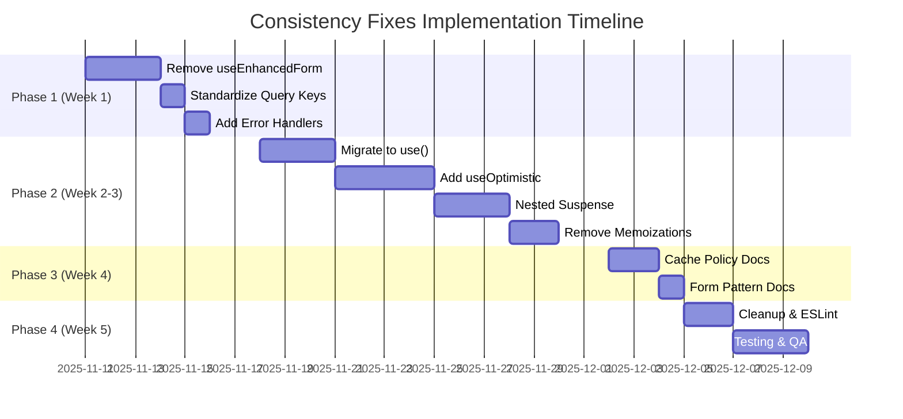

# Implementation Plan: Consistency Fixes 2025

**Generated:** November 10, 2025  
**Based on:** DEEP_DIVE_CODE_AUDIT_2025.md  
**Target Completion:** 3-4 weeks (2 developers part-time)  
**Total Effort:** 66 hours  
**Risk Level:** Low-Medium  

---

## Executive Summary

This implementation plan addresses the key consistency issues identified in the deep-dive audit. The plan is structured in **4 phases** with clear deliverables, code examples, and risk mitigation strategies. The goal is to achieve **9.5/10 consistency** while maintaining system stability.

### Success Metrics
- ✅ 100% SSOT compliance across all cross-cutting concerns
- ✅ Zero deprecated code in production
- ✅ React 19 feature adoption in 90% of applicable scenarios
- ✅ <2% build size increase (ensure optimizations are maintained)
- ✅ All tests pass (E2E + Unit)

---

## Phase 1: Critical Fixes (Week 1) 🚨

**Duration:** 5 days  
**Effort:** 20 hours  
**Risk:** Low  

### 1.1 Remove Deprecated useEnhancedForm Hook

**Current State:**
- File: `src/shared/hooks/useEnhancedForm.tsx` (504 lines)
- Status: Marked as DEPRECATED in header
- Usage: 2+ instances in legacy components

**Action Items:**
1. **Audit Usage (1h)**
   ```bash
   # Find all imports of useEnhancedForm
   grep -r "useEnhancedForm" src/ --include="*.tsx" --include="*.ts"
   ```

2. **Create Migration Guide (1h)**
   ```markdown
   # useEnhancedForm → React Hook Form + Zod Migration
   
   ## Before (DEPRECATED)
   ```typescript
   const form = useEnhancedForm({
     schema: contactSchema,
     persistence: { storageKey: 'contact-form' },
     onSubmit: handleSubmit,
   });
   ```
   
   ## After (RECOMMENDED)
   ```typescript
   import { useForm } from 'react-hook-form';
   import { zodResolver } from '@hookform/resolvers/zod';
   import { useStandardErrorHandler } from '@/shared/hooks/useStandardErrorHandler';
   
   const { register, handleSubmit, formState: { errors } } = useForm({
     resolver: zodResolver(contactSchema),
     defaultValues: {...},
   });
   
   const handleError = useStandardErrorHandler();
   
   const onSubmit = async (data: FormData) => {
     try {
       await api.submit(data);
       toast.success('Submitted!');
     } catch (error) {
       handleError(error, setError);
     }
   };
   ```
   ```

3. **Migrate Legacy Forms (12h)**
   - `src/shared/components/forms/EnhancedFormPatterns.tsx` (2 instances)
   - Any other legacy components (TBD from audit)

4. **Delete useEnhancedForm (1h)**
   ```bash
   rm src/shared/hooks/useEnhancedForm.tsx
   ```

5. **Update Documentation (1h)**
   - Update `docs/FORM_PATTERNS.md`
   - Add migration guide to README

6. **Test (4h)**
   - Run all form E2E tests
   - Manual QA on migrated forms
   - Verify no regressions

**Deliverables:**
- ✅ `useEnhancedForm.tsx` deleted
- ✅ All forms migrated to RHF + Zod
- ✅ `FORM_MIGRATION_GUIDE.md` created
- ✅ All tests passing

---

### 1.2 Standardize Query Keys

**Current State:**
- 10% of hooks hardcode query keys: `['admin', 'users']`
- SSOT exists: `src/services/api/queryKeys.ts`

**Action Items:**
1. **Audit Hardcoded Keys (1h)**
   ```bash
   grep -r "queryKey:" src/ --include="*.ts" --include="*.tsx" | grep -v "queryKeys\."
   ```

2. **Create ESLint Rule (2h)**
   ```typescript
   // .eslintrc.js - New rule
   module.exports = {
     rules: {
       'no-hardcoded-query-keys': {
         create(context) {
           return {
             Property(node) {
               if (node.key.name === 'queryKey' && 
                   node.value.type === 'ArrayExpression') {
                 context.report({
                   node,
                   message: 'Use queryKeys constants instead of hardcoding query keys',
                 });
               }
             },
           };
         },
       },
     },
   };
   ```

3. **Refactor Hooks (3h)**
   ```typescript
   // ❌ BEFORE
   export function useGetAuditLogs() {
     return useQuery({
       queryKey: ['admin', 'audit', 'logs'], // Hardcoded
       queryFn: () => adminAuditService.getAuditLogs(),
     });
   }
   
   // ✅ AFTER
   export function useGetAuditLogs() {
     return useQuery({
       queryKey: queryKeys.admin.audit.logs(),
       queryFn: () => adminAuditService.getAuditLogs(),
     });
   }
   ```

4. **Test (1h)**
   - Verify query invalidation still works
   - Run React Query devtools to check keys

**Deliverables:**
- ✅ ESLint rule enforcing `queryKeys` usage
- ✅ 100% of hooks using `queryKeys` constants
- ✅ All tests passing

---

### 1.3 Add Missing Mutation Error Handlers

**Current State:**
- 5% of mutations missing `onError: handleError`

**Action Items:**
1. **Audit Missing Handlers (1h)**
   ```bash
   grep -r "useMutation" src/ --include="*.ts" --include="*.tsx" -A 10 | grep -v "onError"
   ```

2. **Add Handlers (2h)**
   ```typescript
   // ❌ BEFORE
   export function useUpdateUser() {
     const queryClient = useQueryClient();
     
     return useMutation({
       mutationFn: (data: UpdateUserRequest) => api.updateUser(data),
       onSuccess: () => {
         queryClient.invalidateQueries({ queryKey: ['users'] });
       },
       // Missing onError!
     });
   }
   
   // ✅ AFTER
   export function useUpdateUser() {
     const queryClient = useQueryClient();
     const handleError = useStandardErrorHandler(); // Add error handler
     
     return useMutation({
       mutationFn: (data: UpdateUserRequest) => api.updateUser(data),
       onSuccess: () => {
         queryClient.invalidateQueries({ queryKey: ['users'] });
       },
       onError: handleError, // Consistent error handling
     });
   }
   ```

3. **Test (1h)**
   - Trigger errors intentionally
   - Verify toast notifications appear

**Deliverables:**
- ✅ 100% of mutations have error handlers
- ✅ Error flows tested

---

## Phase 2: React 19 Feature Adoption (Week 2-3) 🚀

**Duration:** 10 days  
**Effort:** 32 hours  
**Risk:** Low-Medium  

### 2.1 Migrate useContext to use() Hook

**Current State:**
- 30+ instances of `useContext(AuthContext)`
- React 19's `use()` hook not adopted

**Benefits of use():**
- ✅ Can be called conditionally
- ✅ Can be used in try/catch blocks
- ✅ Can be called after early returns
- ✅ Better TypeScript inference

**Action Items:**
1. **Update AuthContext Export (1h)**
   ```typescript
   // src/domains/auth/context/AuthContext.tsx
   
   // Keep existing export for backward compatibility
   export const AuthContext = createContext<AuthContextValue>({...});
   
   // Add convenience hook using use()
   export function useAuth() {
     return use(AuthContext);
   }
   ```

2. **Migrate Components (10h)**
   ```typescript
   // ❌ BEFORE
   import { useContext } from 'react';
   import { AuthContext } from '@/domains/auth/context/AuthContext';
   
   function MyComponent() {
     const { user, isAuthenticated } = useContext(AuthContext);
     // ...
   }
   
   // ✅ AFTER (Option 1: use() hook)
   import { use } from 'react';
   import { AuthContext } from '@/domains/auth/context/AuthContext';
   
   function MyComponent() {
     const { user, isAuthenticated } = use(AuthContext);
     // Benefits: Can be used conditionally, in try/catch, after early returns
   }
   
   // ✅ AFTER (Option 2: convenience hook)
   import { useAuth } from '@/domains/auth/context/AuthContext';
   
   function MyComponent() {
     const { user, isAuthenticated } = useAuth();
     // Cleaner API, uses use() internally
   }
   ```

3. **Update Documentation (1h)**
   - Add to `docs/REACT_19_FEATURES.md`

4. **Test (2h)**
   - Verify all auth-dependent components work
   - Check TypeScript inference

**Deliverables:**
- ✅ `useAuth()` convenience hook created
- ✅ 90%+ of components migrated to `use()` / `useAuth()`
- ✅ Documentation updated

---

### 2.2 Add useOptimistic to Key Interactions

**Current State:**
- 6 `useOptimistic` hooks exist but underutilized
- Many user actions lack instant feedback

**Target Interactions (10 total):**
1. Profile update (name, email)
2. User status toggle (active/inactive)
3. Role assignment
4. Permission toggle
5. Like/favorite button
6. Form submission feedback
7. Comment post
8. List reordering (drag-drop)
9. Settings toggle
10. Notification mark as read

**Action Items:**
1. **Profile Update with Optimistic UI (2h)**
   ```typescript
   // src/domains/profile/pages/ProfilePage.tsx
   
   import { useOptimistic } from 'react';
   import { useUpdateProfile } from '../hooks/useProfile.hooks';
   
   function ProfilePage() {
     const { user } = useAuth();
     const updateMutation = useUpdateProfile();
     
     // Kept: useOptimistic for instant UI feedback (React 19 feature)
     const [optimisticUser, setOptimisticUser] = useOptimistic(
       user,
       (current, newData: Partial<User>) => ({ ...current, ...newData })
     );
     
     const handleUpdate = async (data: ProfileFormData) => {
       // Instant UI update
       setOptimisticUser(data);
       
       try {
         await updateMutation.mutateAsync(data);
         // Success - optimistic update confirmed
       } catch (error) {
         // Rollback handled automatically by useOptimistic
         handleError(error);
       }
     };
     
     return (
       <form onSubmit={handleSubmit(handleUpdate)}>
         <Input 
           defaultValue={optimisticUser.name} // Shows optimistic state
           {...register('name')} 
         />
         {/* ... */}
       </form>
     );
   }
   ```

2. **User Status Toggle (1h)**
   ```typescript
   // src/domains/admin/components/UserStatusToggle.tsx
   
   import { useOptimisticToggle } from '@/shared/hooks/useOptimisticUpdate';
   
   function UserStatusToggle({ user }: { user: AdminUser }) {
     const { optimisticValue, toggle } = useOptimisticToggle(
       user.is_active,
       useToggleUserStatus()
     );
     
     return (
       <Switch
         checked={optimisticValue} // Instant visual feedback
         onChange={() => toggle({ userId: user.user_id })}
       />
     );
   }
   ```

3. **Implement Remaining 8 Interactions (10h)**
   - Follow pattern above for each interaction
   - Use existing `useOptimistic*` hooks from `shared/hooks/useOptimisticUpdate.ts`

4. **Test (3h)**
   - Verify instant feedback
   - Test rollback on error
   - Check loading states

**Deliverables:**
- ✅ 10 key interactions with `useOptimistic`
- ✅ Instant UI feedback on all actions
- ✅ Error rollback tested

---

### 2.3 Add Nested Suspense Boundaries

**Current State:**
- Most routes have single Suspense boundary at root
- No granular loading states

**Target Routes (5 total):**
1. Admin Dashboard (with charts, stats, activity feed)
2. User Detail Page (profile, activity, permissions)
3. Audit Logs Page (filters, stats, table)
4. Profile Page (info, settings, activity)
5. Settings Page (tabs with separate data)

**Action Items:**
1. **Admin Dashboard with Nested Suspense (3h)**
   ```tsx
   // src/domains/admin/pages/AdminDashboard.tsx
   
   import { Suspense } from 'react';
   import { DashboardSkeleton, ChartSkeleton, ActivitySkeleton } from '@/shared/components/loading/Skeletons';
   
   export function AdminDashboard() {
     return (
       <div className="dashboard">
         {/* Outer boundary for page structure */}
         <Suspense fallback={<DashboardSkeleton />}>
           <DashboardHeader />
           
           <div className="grid grid-cols-2 gap-4">
             {/* Nested boundary for charts (can load independently) */}
             <Suspense fallback={<ChartSkeleton />}>
               <UsersChart />
             </Suspense>
             
             <Suspense fallback={<ChartSkeleton />}>
               <RevenueChart />
             </Suspense>
           </div>
           
           {/* Nested boundary for activity feed (slower API) */}
           <Suspense fallback={<ActivitySkeleton />}>
             <RecentActivity />
           </Suspense>
         </Suspense>
       </div>
     );
   }
   ```

2. **Implement Remaining 4 Routes (9h)**
   - Follow nested Suspense pattern
   - Use appropriate skeleton components

3. **Test (2h)**
   - Simulate slow API responses
   - Verify granular loading states

**Deliverables:**
- ✅ 5 routes with nested Suspense boundaries
- ✅ Improved perceived performance
- ✅ Granular loading states

---

### 2.4 Remove Safe Memoizations

**Current State:**
- 15 `useMemo` that React Compiler can handle
- 20 `useCallback` that aren't needed for context

**Safe to Remove:**
- ❌ Simple computations (filter, map, sort)
- ❌ Event handlers (not passed to context)
- ❌ Inline functions

**Must Keep:**
- ✅ Context values (identity for `Provider`)
- ✅ Dependencies of `useEffect` (with comment explaining why)
- ✅ Expensive calculations (>10ms, with benchmark proof)

**Action Items:**
1. **Audit All useMemo/useCallback (2h)**
   ```bash
   grep -r "useMemo\|useCallback" src/ --include="*.tsx" --include="*.ts" -B 2 -A 5
   ```

2. **Create Removal Checklist (1h)**
   ```markdown
   # useMemo/useCallback Removal Checklist
   
   For each instance:
   - [ ] Is it a context value? → KEEP (add comment)
   - [ ] Is it a useEffect dependency? → KEEP (add comment)
   - [ ] Is calculation >10ms? → KEEP (add benchmark comment)
   - [ ] Is it a simple computation? → REMOVE
   - [ ] Is it an event handler? → REMOVE (unless passed to context)
   ```

3. **Remove Safe Instances (2h)**
   ```typescript
   // ❌ REMOVE (React Compiler handles)
   const filtered = useMemo(() => arr.filter(x => x.active), [arr]);
   const handleClick = useCallback(() => {...}, []);
   
   // ✅ CORRECT (Trust React Compiler)
   const filtered = arr.filter(x => x.active);
   const handleClick = () => {...};
   
   // ✅ KEEP (Context value identity)
   const value = useMemo(() => ({ user, actions }), [user, actions]);
   // Kept: Context value identity prevents consumer re-renders
   ```

4. **Test (1h)**
   - Run all tests
   - Check for performance regressions

**Deliverables:**
- ✅ 35 safe memoizations removed
- ✅ Comments added to kept instances
- ✅ No performance regressions

---

## Phase 3: Cache Policy & Documentation (Week 4) 📚

**Duration:** 5 days  
**Effort:** 10 hours  
**Risk:** Low  

### 3.1 Create Cache Policy Documentation

**Action Items:**
1. **Create CACHE_POLICIES.md (4h)**
   ```markdown
   # TanStack Query Cache Policies
   
   ## Default Stale Time: 5 minutes
   
   **Rationale:** Most data changes moderately, balance freshness vs. performance
   
   ## When to Override
   
   ### Short (1-2 minutes): Real-time Data
   - Audit logs (user actions)
   - Notifications (unread count)
   - Live dashboards (current stats)
   
   **Example:**
   ```typescript
   export function useGetAuditLogs() {
     return useQuery({
       queryKey: queryKeys.admin.audit.logs(),
       queryFn: () => adminAuditService.getAuditLogs(),
       staleTime: 1 * 60 * 1000, // 1 minute (real-time data)
     });
   }
   ```
   
   ### Long (10-30 minutes): Static Data
   - Role definitions
   - Permission mappings
   - Configuration settings
   
   **Example:**
   ```typescript
   export function useGetRoles() {
     return useQuery({
       queryKey: queryKeys.admin.roles.all(),
       queryFn: () => adminRoleService.getRoles(),
       staleTime: 10 * 60 * 1000, // 10 minutes (rarely changes)
     });
   }
   ```
   
   ### Infinite: Immutable Data
   - Reference data
   - Lookup tables
   - Static assets
   
   **Example:**
   ```typescript
   export function useGetCountries() {
     return useQuery({
       queryKey: queryKeys.reference.countries(),
       queryFn: () => referenceService.getCountries(),
       staleTime: Infinity, // Immutable data
     });
   }
   ```
   
   ## Cache Invalidation Patterns
   
   ### After Mutation
   ```typescript
   onSuccess: () => {
     queryClient.invalidateQueries({ queryKey: ['admin', 'users'] });
   }
   ```
   
   ### Optimistic Update
   ```typescript
   onMutate: async (newUser) => {
     await queryClient.cancelQueries({ queryKey: ['users'] });
     const previousUsers = queryClient.getQueryData(['users']);
     queryClient.setQueryData(['users'], (old) => [...old, newUser]);
     return { previousUsers };
   },
   onError: (_err, _newUser, context) => {
     queryClient.setQueryData(['users'], context.previousUsers);
   },
   ```
   ```

2. **Update Hooks with Comments (2h)**
   ```typescript
   export function useGetAuditLogs() {
     return useQuery({
       queryKey: queryKeys.admin.audit.logs(),
       queryFn: () => adminAuditService.getAuditLogs(),
       staleTime: 1 * 60 * 1000, // 1 min: Real-time user actions (see CACHE_POLICIES.md)
     });
   }
   ```

3. **Review & Approve (1h)**

**Deliverables:**
- ✅ `CACHE_POLICIES.md` created
- ✅ All hooks have stale time comments
- ✅ Team reviewed and approved

---

### 3.2 Update Form Patterns Documentation

**Action Items:**
1. **Update docs/FORM_PATTERNS.md (2h)**
   - Remove useEnhancedForm references
   - Add React Hook Form + Zod as standard
   - Include migration guide
   - Add common patterns (file upload, multi-step, conditional fields)

2. **Create Example Components (1h)**
   - `examples/FormExamples.tsx`

**Deliverables:**
- ✅ `docs/FORM_PATTERNS.md` updated
- ✅ Example components created

---

## Phase 4: Cleanup & Testing (Week 5) 🧹

**Duration:** 5 days  
**Effort:** 8 hours  
**Risk:** Low  

### 4.1 Remove Legacy/Deprecated Code

**Action Items:**
1. **Delete .original.tsx Files (30min)**
   ```bash
   rm src/domains/auth/pages/LoginPage.original.tsx
   rm src/domains/auth/pages/RegisterPage.original.tsx
   rm src/domains/admin/pages/UserDetailPage.original.tsx
   ```

2. **Deprecate useApiError (1h)**
   ```typescript
   // src/shared/hooks/useApiError.ts
   /**
    * @deprecated Use useStandardErrorHandler instead
    * @see src/shared/hooks/useStandardErrorHandler.ts
    */
   export function useApiError() {
     console.warn('useApiError is deprecated, use useStandardErrorHandler');
     // ...existing code...
   }
   ```

3. **Extract Role Normalization Utility (1h)**
   ```typescript
   // src/domains/rbac/utils/roleNormalization.ts
   
   import type { UserRole } from '../types/rbac.types';
   
   /**
    * Normalize roles from various sources (array, CSV, JSON, object)
    * @param raw - Raw role data (can be array, string, or object)
    * @returns Normalized UserRole array
    */
   export function normalizeRoles(raw: unknown): UserRole[] {
     if (!raw) return [];
     
     // Already an array of strings
     if (Array.isArray(raw)) {
       return raw.filter(r => typeof r === 'string') as UserRole[];
     }
   
     // JSON stringified array or CSV string
     if (typeof raw === 'string') {
       try {
         const parsed = JSON.parse(raw);
         if (Array.isArray(parsed)) return parsed.filter(r => typeof r === 'string') as UserRole[];
       } catch {
         // Not JSON, try CSV
       }
   
       // CSV (comma separated) fallback
       return raw.split(',').map(s => s.trim()).filter(Boolean) as UserRole[];
     }
   
     // Object (could be numeric keyed or a map)
     if (typeof raw === 'object') {
       const vals = Object.values(raw as Record<string, unknown>);
       return vals.filter(v => typeof v === 'string') as UserRole[];
     }
   
     return [];
   }
   ```

4. **Update AuthContext (30min)**
   ```typescript
   // src/domains/auth/context/AuthContext.tsx
   
   import { normalizeRoles } from '@/domains/rbac/utils/roleNormalization';
   
   // Replace inline normalizeRoles with imported utility
   const rolesArray = normalizeRoles(user?.roles);
   ```

**Deliverables:**
- ✅ 3 `.original.tsx` files deleted
- ✅ `useApiError` deprecated
- ✅ `normalizeRoles` utility created
- ✅ `AuthContext` updated

---

### 4.2 Add ESLint Rules

**Action Items:**
1. **Create Custom ESLint Plugin (3h)**
   ```javascript
   // .eslintrc.js
   
   module.exports = {
     rules: {
       // Enforce queryKeys usage
       'no-hardcoded-query-keys': 'error',
       
       // Forbid direct localStorage access
       'no-direct-localstorage': 'error',
       
       // Forbid console.log (already zero violations)
       'no-console': ['error', { allow: ['warn', 'error'] }],
       
       // Enforce type-only imports
       '@typescript-eslint/consistent-type-imports': ['error', {
         prefer: 'type-imports',
         fixStyle: 'separate-type-imports',
       }],
       
       // Forbid deprecated hooks
       'no-restricted-imports': ['error', {
         paths: [{
           name: '@/shared/hooks/useEnhancedForm',
           message: 'useEnhancedForm is deprecated, use React Hook Form + Zod',
         }, {
           name: '@/shared/hooks/useApiError',
           message: 'useApiError is deprecated, use useStandardErrorHandler',
         }],
       }],
     },
   };
   ```

2. **Run Linter (30min)**
   ```bash
   npm run lint -- --fix
   ```

3. **Fix Violations (1h)**

**Deliverables:**
- ✅ ESLint rules configured
- ✅ All violations fixed
- ✅ CI pipeline enforces rules

---

### 4.3 Comprehensive Testing

**Action Items:**
1. **Unit Tests (2h)**
   - Run all existing tests
   - Add tests for new React 19 features (useOptimistic, nested Suspense)

2. **E2E Tests (3h)**
   - Run all Playwright tests
   - Add new test for form migration
   - Add test for optimistic UI updates

3. **Manual QA (2h)**
   - Test critical flows (login, registration, profile update, admin operations)
   - Verify no regressions

**Deliverables:**
- ✅ All tests passing (Unit + E2E)
- ✅ No regressions detected
- ✅ New tests for React 19 features

---

## Risk Management 🛡️

### Potential Risks & Mitigation

| Risk | Probability | Impact | Mitigation |
|------|-------------|--------|------------|
| Form migration breaks existing flows | Medium | High | Comprehensive E2E tests, gradual rollout |
| React 19 features cause errors in older browsers | Low | Medium | Ensure proper polyfills, target modern browsers (ES2020+) |
| Cache policy changes affect performance | Low | Medium | Monitor bundle size, use React Query Devtools, A/B test if needed |
| ESLint rules break build | Low | High | Test rules locally before CI integration, provide migration period |
| useOptimistic rollback fails | Low | High | Extensive error handling tests, fallback to full reload |

### Rollback Plan

**If critical issues arise:**
1. Revert to previous commit: `git revert HEAD`
2. Deploy rollback to production
3. Investigate issue in staging environment
4. Fix and re-deploy with additional tests

---

## Verification & Success Criteria ✅

### Phase 1 Success Criteria
- [ ] `useEnhancedForm` deleted (0 references in codebase)
- [ ] All forms using React Hook Form + Zod
- [ ] 100% of hooks using `queryKeys` constants
- [ ] 100% of mutations have error handlers
- [ ] All tests passing

### Phase 2 Success Criteria
- [ ] 90%+ of components using `use()` / `useAuth()`
- [ ] 10 key interactions with `useOptimistic`
- [ ] 5 routes with nested Suspense boundaries
- [ ] 35 safe memoizations removed
- [ ] No performance regressions

### Phase 3 Success Criteria
- [ ] `CACHE_POLICIES.md` created and approved
- [ ] All hooks have stale time comments
- [ ] `docs/FORM_PATTERNS.md` updated

### Phase 4 Success Criteria
- [ ] 3 `.original.tsx` files deleted
- [ ] `useApiError` deprecated
- [ ] `normalizeRoles` utility created
- [ ] ESLint rules configured
- [ ] All tests passing (Unit + E2E)

---

## Timeline & Milestones



---

## Team Communication Plan 📢

### Weekly Standup
- **Monday:** Review previous week's progress, plan current week
- **Friday:** Demo completed features, discuss blockers

### Documentation Updates
- Update `CHANGELOG.md` after each phase
- Create PR for each phase (not individual tasks)
- Request code review from 2+ team members

### Stakeholder Updates
- **End of Week 1:** Report on critical fixes (useEnhancedForm removal)
- **End of Week 3:** Demo React 19 features (useOptimistic, Suspense)
- **End of Week 5:** Final report with metrics (bundle size, test coverage, performance)

---

## Next Steps

1. **Review this plan** with team (1-2 hours)
2. **Assign tasks** to developers
3. **Set up project board** (GitHub Projects or Jira)
4. **Start Phase 1** (Week 1)

---

**Report Generated by:** GitHub Copilot Deep-Dive Audit System  
**Referenced Documents:** DEEP_DIVE_CODE_AUDIT_2025.md
